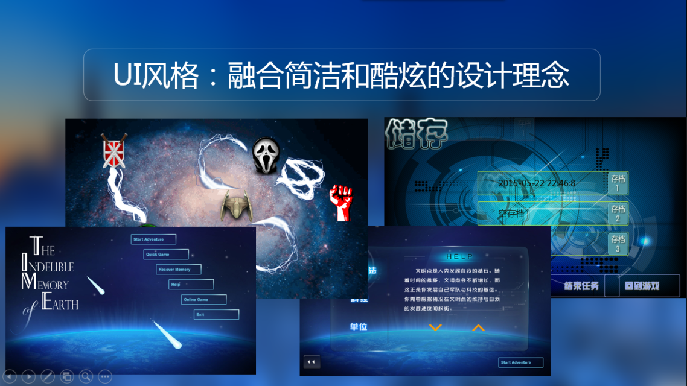
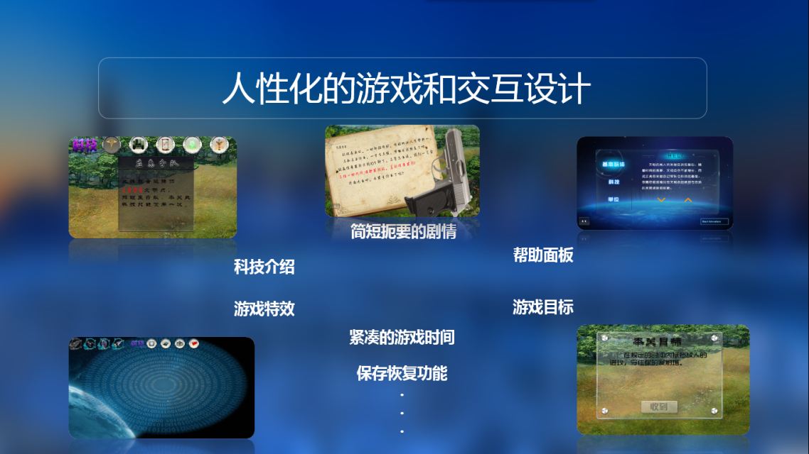
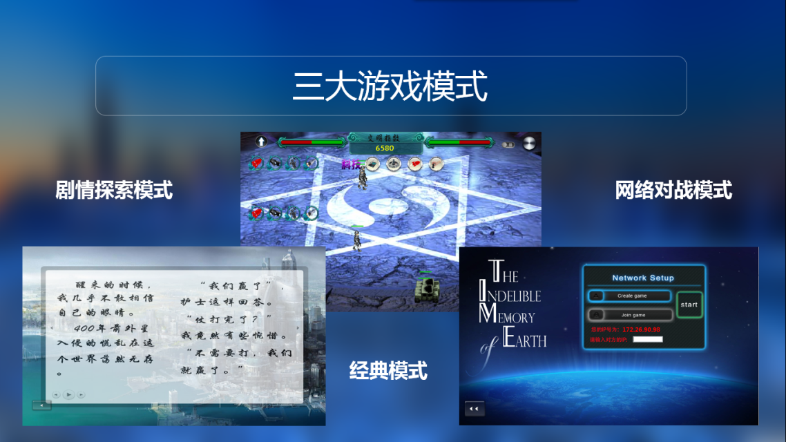
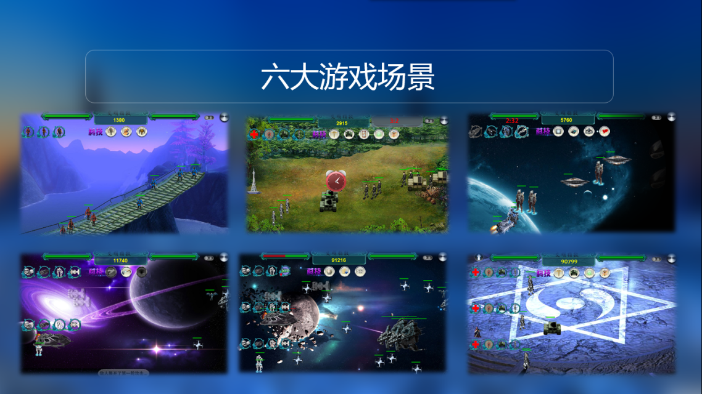
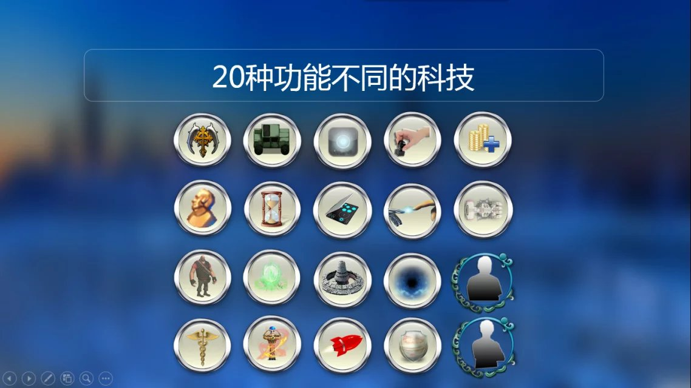
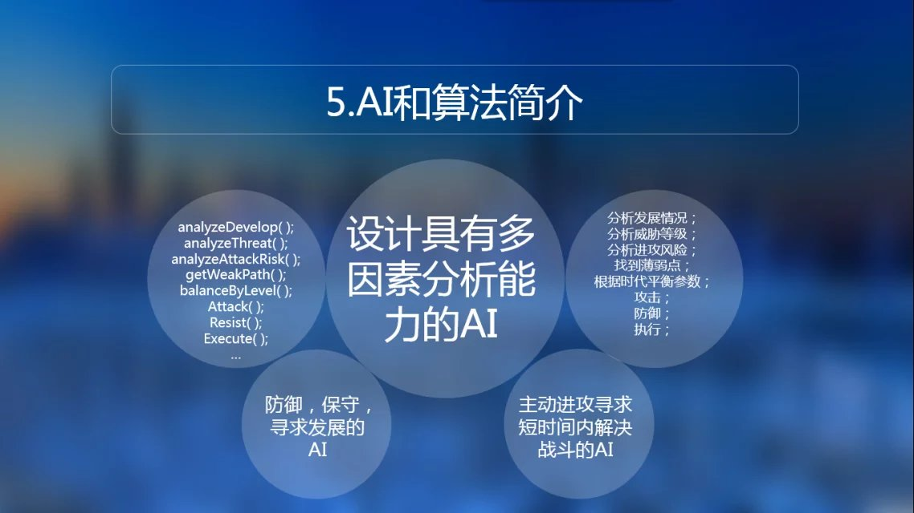

# Time : 基于Java swing的以《三体》为背景的对战小游戏
##游戏截图:

##运行方法：
点击`TIME.jar`运行，运行目录下必须有`/music`和`/graphics`资源文件夹。
##游戏介绍：
TIME是一款拥有单人和联机模式的对战/塔防游戏。 
游戏基于《三体》小说的故事背景，用6个场景描述了小说中不同时间发生的重要事件。游戏采用对战/塔防模式，在重现剧情的同时保证了游戏难度。
##制作团队：
TIME开发于2015年4月-2015年5月。 
